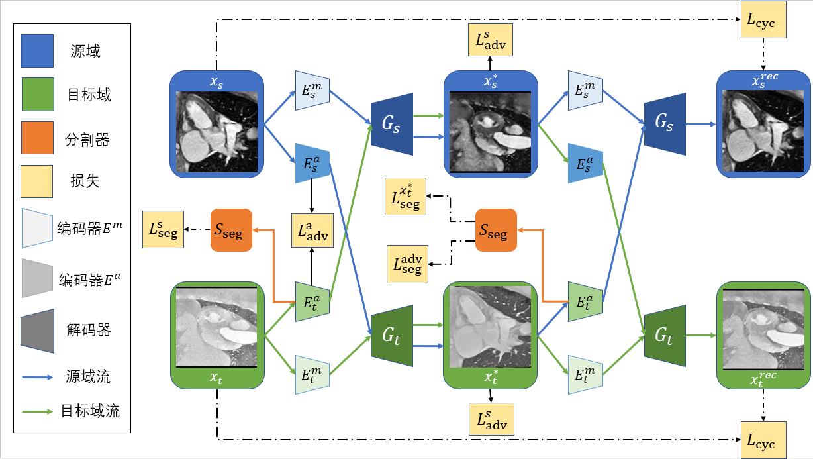

## Unsupervised Domain Adaptation for  Medical Image Segmentation

> Undergraduate thesis of Lawliet from School of Mathematics, Sun Yat-sen University.

**Data Preparation**

Raw data needs to be written into `tfrecord` format to be converted to `npy` by `./dataset/tf2npy.py`. The pre-processed data has been released from our work [PnP-AdaNet](https://github.com/carrenD/Medical-Cross-Modality-Domain-Adaptation). The training data can be downloaded [here](https://drive.google.com/file/d/1m9NSHirHx30S8jvN0kB-vkd7LL0oWCq3/view). The testing CT data can be downloaded [here](https://drive.google.com/file/d/1SJM3RluT0wbR9ud_kZtZvCY0dR9tGq5V/view). The testing MR data can be downloaded [here](https://drive.google.com/file/d/1Bm2uU4hQmn5L3GwXz6I0vuCN3YVMEc8S/view?usp=sharing).

**Train**

- Modify the data statistics in `mmwhs.py` according to the specifc dataset in use. Note that this is a very important step to correctly convert the data range to $[-1, 1]$ for the network inputs and ensure the performance.

- Modify paramter values in `./configs/defaults.py`

- Run `./train.py` to start the training process